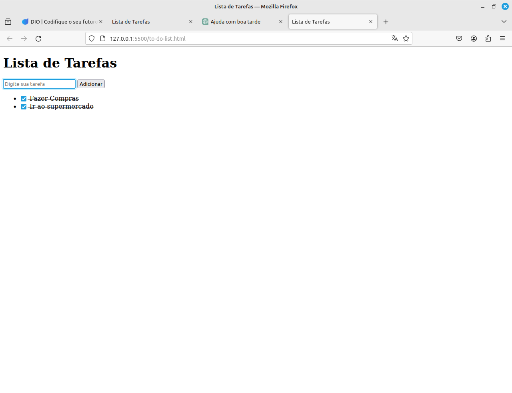

# Desafio To-do list

1.  Crie um campo de input de texto e um botão para adicionar a tarefa a lista;
2.  Quando o botão for pressionado, o texto deve aparecer na lista com um checkbox ao lado;
3.  Quando o usuário selecionar o checkbox, o item correspondente deve ficar com o texto riscado.( ex: dica você pode resolver isso facilmente com css 
